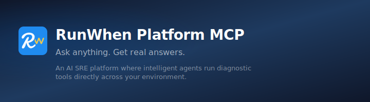

<div align="center">



# RunWhen Platform MCP

**RunWhen Platform MCP** lets your coding agent (such as Cursor, Claude, Continue, or Copilot) talk to the RunWhen platform — workspace chat, issues, SLXs, run sessions, and the Tool Builder — over the [Model Context Protocol](https://modelcontextprotocol.io) (MCP).

[](https://pypi.org/project/runwhen-platform-mcp/)
[](https://pypi.org/project/runwhen-platform-mcp/)
[](https://opensource.org/licenses/Apache-2.0)
[](https://modelcontextprotocol.io)

[GitHub](https://github.com/runwhen-contrib/runwhen-platform-mcp) · [PyPI](https://pypi.org/project/runwhen-platform-mcp/) · **Tools** (below)

</div>

---

## Key features

- **Workspace chat**: Ask the RunWhen AI assistant about your infrastructure. It has access to issue search, task/SLX search, run sessions, resource discovery, knowledge base, graphing, and Mermaid diagrams. Supports selecting an assistant (persona) via `persona_name`.
- **Task authoring (Tool Builder)**: Write bash or Python scripts locally, validate them against the RunWhen contract, run them against live infrastructure, and commit them as SLXs. Use `get_workspace_context` to load `RUNWHEN.md` conventions before writing.
- **Direct data access**: List workspaces, issues, SLXs, run sessions; get runbooks and config index; search tasks and resources. Plus create and update chat rules and commands.

## Requirements

- **Python** 3.10 or newer
- **RunWhen** account and API token (see [Getting a token](#getting-a-token))
- Any MCP client (Cursor, Claude Desktop, Continue, etc.)

## Getting started

1. **Install** the server:

   ```bash
   pip install runwhen-platform-mcp
   ```

   Or from source (use a venv and then point your MCP client at the venv’s `runwhen-platform-mcp`):

   ```bash
   git clone https://github.com/runwhen-contrib/runwhen-platform-mcp.git
   cd runwhen-platform-mcp
   python3 -m venv .venv
   source .venv/bin/activate   # Windows: .venv\Scripts\activate
   pip install -e .
   ```

2. **Set environment variables** (see [Configuration](#configuration)): `RW_API_URL`, `RUNWHEN_TOKEN`, and optionally `DEFAULT_WORKSPACE`.

3. **Add the server to your MCP client** using the config below. Replace `your-jwt-token` and `your-workspace` with your RunWhen token and workspace name.

Add the following to your MCP client config:

```json
{
  "mcpServers": {
    "runwhen": {
      "command": "runwhen-platform-mcp",
      "env": {
        "RW_API_URL": "https://papi.beta.runwhen.com",
        "RUNWHEN_TOKEN": "your-jwt-token",
        "DEFAULT_WORKSPACE": "your-workspace"
      }
    }
  }
}
```

If you installed from source into a venv, use the **full path** to the venv’s `runwhen-platform-mcp` as `command` (e.g. `/path/to/runwhen-platform-mcp/.venv/bin/runwhen-platform-mcp`). Find it with `which runwhen-platform-mcp` after activating the venv.

---

## MCP client configuration

Configure the RunWhen MCP server in your client as shown below. Use the JSON block from [Getting started](#getting-started); only the **location** of the config differs by client.

### Cursor

Go to **Cursor Settings** → **MCP** → **New MCP Server** (or edit `.cursor/mcp.json`). Paste the config from [Getting started](#getting-started). If you use a venv, set `command` to the full path to `.venv/bin/runwhen-platform-mcp`.

### Claude Desktop

Add the config to:

- **macOS**: `~/Library/Application Support/Claude/claude_desktop_config.json`
- **Windows**: `%APPDATA%\Claude\claude_desktop_config.json`
- **Linux**: `~/.config/claude/claude_desktop_config.json`

Use the same `mcpServers.runwhen` block as in [Getting started](#getting-started).

### Other MCP clients

Any client that supports MCP over stdio can use this server. Register a local MCP server with:

- **Command**: `runwhen-platform-mcp` (or full path to the venv’s `runwhen-platform-mcp` if you installed from source)
- **Env**: `RW_API_URL`, `RUNWHEN_TOKEN`, and optionally `DEFAULT_WORKSPACE`

See your client’s docs for where to add MCP servers (e.g. Continue, Codex, Gemini CLI, etc.).

---

## Your first prompt

After the server is connected, try:

```
What workspaces do I have access to?
```

or:

```
Summarize the current issues in my workspace.
```

Your client should call `list_workspaces` or `get_workspace_issues` and show the result. For the full chat experience, try:

```
Using workspace chat, what tasks are watching my production namespace?
```

---

## Tools

The server exposes these tools, grouped by use case.

- **Workspace intelligence** (10 tools)
  - `workspace_chat` — Ask the RunWhen AI assistant about your infrastructure (issues, tasks, run sessions, resources, knowledge base). Optional `persona_name` to select an assistant.
  - `list_workspaces` — List workspaces you have access to.
  - `get_workspace_chat_config` — Get resolved chat rules and commands (metadata). Optional `persona_name`.
  - `get_workspace_issues` — Current issues; optional severity filter (1–4).
  - `get_workspace_slxs` — List SLXs (health checks and tasks).
  - `get_run_sessions` — Recent run session results.
  - `get_workspace_config_index` — Workspace config and resource relationships.
  - `get_issue_details` — Details for a specific issue by ID.
  - `get_slx_runbook` — Runbook definition for an SLX.
  - `search_workspace` — Search tasks, resources, and config by keyword.

- **Chat rules and commands** (8 tools)
  - `list_chat_rules` — List chat rules (optional filters: scope_type, scope_id, is_active).
  - `get_chat_rule` — Get a chat rule by ID (full content).
  - `create_chat_rule` — Create a rule (name, ruleContent, scopeType, scopeId, isActive).
  - `update_chat_rule` — Update a rule by ID.
  - `list_chat_commands` — List chat commands (slash-commands).
  - `get_chat_command` — Get a command by ID (full content).
  - `create_chat_command` — Create a command (name, commandContent, scopeType, scopeId).
  - `update_chat_command` — Update a command by ID.

- **Task authoring — Tool Builder** (9 tools)
  - `get_workspace_context` — Load `RUNWHEN.md` from the project. **Call before writing scripts** so the agent follows your conventions.
  - `validate_script` — Validate a script against the RunWhen contract (main, issue format, FD 3 for bash).
  - `run_script` — Run a script on a RunWhen runner; returns run ID.
  - `get_run_status` — Status of a run (RUNNING, SUCCEEDED, FAILED).
  - `get_run_output` — Parsed output (issues, stdout, stderr, report).
  - `run_script_and_wait` — Run script and wait for full results (run + poll + output).
  - `commit_slx` — Commit a tested script as an SLX (task + optional SLI; supports `sli_script` or `cron_schedule`).
  - `get_workspace_secrets` — List secret keys (e.g. `kubeconfig`).
  - `get_workspace_locations` — List runner locations for script execution.

---

## Configuration

### Environment variables

| Variable | Required | Description |
|----------|----------|-------------|
| `RW_API_URL` | Yes | RunWhen API base URL (e.g. `https://papi.beta.runwhen.com`). Agent URL is derived (subdomain `papi` → `agentfarm`). |
| `RUNWHEN_TOKEN` | Yes | RunWhen API token (JWT or Personal Access Token). Used for both API and Agent. |
| `DEFAULT_WORKSPACE` | No | Default workspace so tools don’t need `workspace_name` every time. |
| `RUNWHEN_CONTEXT_FILE` | No | Override path to `RUNWHEN.md`; otherwise auto-discovered from cwd. |

See `.env.example` in the repo.

### Getting a token

- **Personal Access Token** (recommended, up to 180 days): RunWhen UI → **Settings** → **Access Tokens** → **Create Token**.
- **Email/password** (short-lived): `POST {RW_API_URL}/api/v3/token/` with `{"email": "...", "password": "..."}`.
- **Browser**: Dev Tools → Network → copy `Authorization: Bearer ...` from any API request.

### Access control and "Run with Assistant"

Workspace roles: **readonly**, **readandrun**, **readandrunwithassistant**, **readwrite**, **admin**.

- **Read and Run with Assistant** (`readandrunwithassistant`): Run tasks only when tied to an assistant (persona) you’re allowed to use. Applies to **run sessions** (e.g. Run button in the UI), not Tool Builder script runs.
- **Workspace chat**: Use `persona_name` in `workspace_chat` / `get_workspace_chat_config` to use chat in the context of an assistant you’re allowed to use.
- **Tool Builder run** (`run_script`, `run_script_and_wait`): Uses **author/run** API; currently **admin** only. No "run with assistant" for MCP script execution today.
- **commit_slx**: Requires **admin** or **readwrite**.

---

## Concepts

### How it works

- **Workspace chat**: The server forwards `workspace_chat` to the RunWhen Agent (AgentFarm), which has many internal tools. You ask in natural language; optional `persona_name` selects the assistant.
- **Tool Builder flow**: Load context (`get_workspace_context`) → write script → validate → get secrets/locations → test with `run_script_and_wait` → iterate → `commit_slx` → verify with `get_workspace_slxs`.
- **Knowledge base**: Search happens inside `workspace_chat`. To add notes, use the **/remember** command in the RunWhen UI.

### Infrastructure context (RUNWHEN.md)

Put a `RUNWHEN.md` in your project root with infrastructure rules (DBs, naming, severity, etc.). The server discovers it by walking up from the current working directory. Agents should call `get_workspace_context` before writing scripts.

- **Template**: `runwhen_platform_mcp/docs/RUNWHEN.md.template`
- **Example**: `runwhen_platform_mcp/docs/RUNWHEN.md.example`
- **Flow and SLI patterns**: `runwhen_platform_mcp/docs/tool-builder-flow.md`

---

## What’s in this repo

| Component | Path | Description |
|-----------|------|-------------|
| **MCP server** | `runwhen_platform_mcp/` | Python package; run via `runwhen-platform-mcp` or `python -m runwhen_platform_mcp.server`. |
| **Docs** | `runwhen_platform_mcp/docs/` | Tool Builder flow, RUNWHEN.md template/example. |
| **Tests** | `tests/` | Pytest tests; run with `pytest tests/ -v` (see `requirements-dev.txt`). |
| **Rules, skills, agents** | `rules/`, `skills/`, `agents/` | Optional Cursor rules, skills, and agent personas. |
| **Cursor plugin** | `.cursor-plugin/`, `mcp.json` | Plugin metadata and example MCP config. |

The MCP server is client-agnostic; Cursor-specific pieces are optional.

---

## Development and testing

```bash
pip install -e .
pip install -r requirements-dev.txt
pytest tests/ -v
```

CI runs tests on push and PRs to `main` (`.github/workflows/test.yml`).

---

## PyPI release

Releases are published to PyPI via GitHub Actions when relevant paths change on `main`, using [runwhen-contrib/github-actions/publish-pypi](https://github.com/runwhen-contrib/github-actions) with date-based versioning (`YYYY.MM.DD.N`). Configure `PYPI_TOKEN` (and optionally `SLACK_BOT_TOKEN` / `slack_channel`) in repo secrets.

---

## License

Apache-2.0
