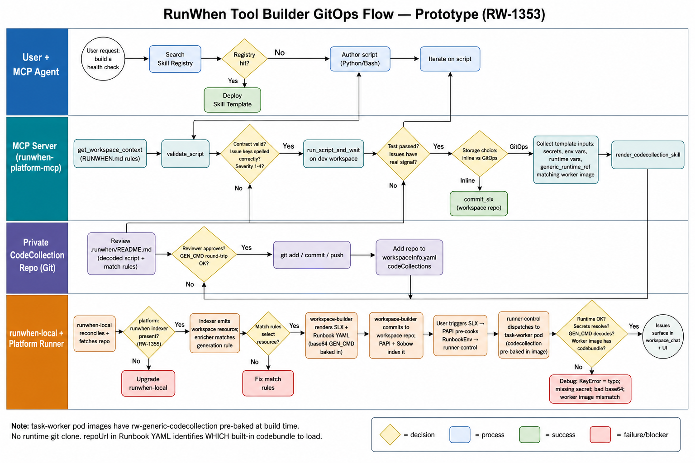
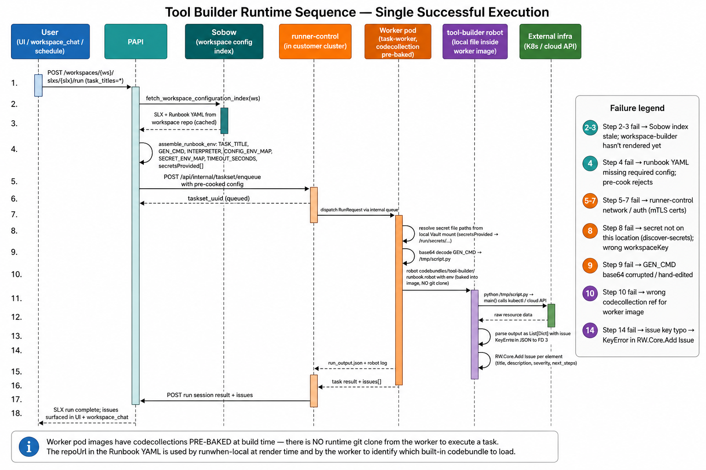
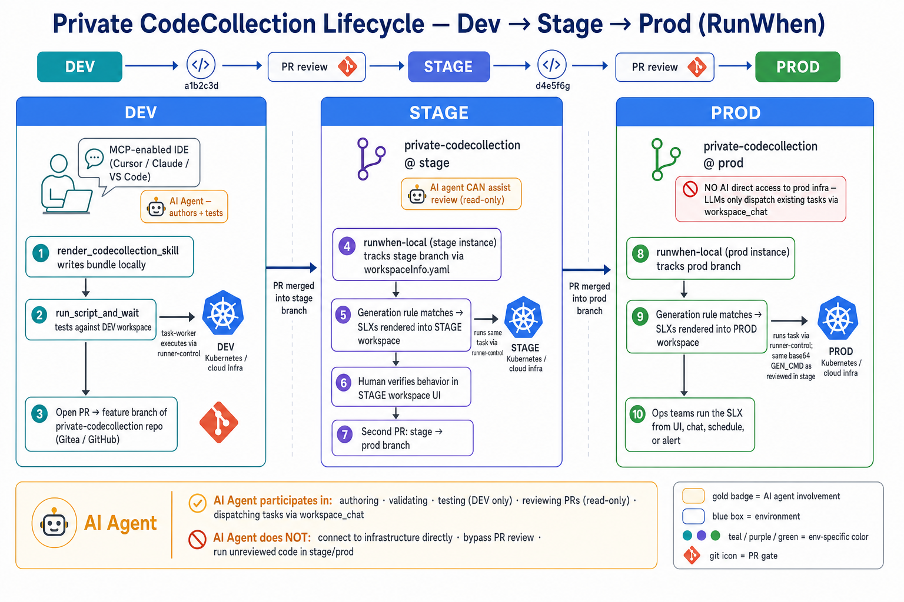

# Tool Builder → CodeCollection → Discovery — Prototype User Flow

**Status:** Prototype (RW-1353). Requires runwhen-local with `platform: runwhen` (RW-1355).
**Audience:** Contributors and reviewers evaluating the MCP-authored GitOps path for custom RunWhen tasks.



---

## Why this flow exists

RunWhen has two established authoring paths that leave a gap:

1. **`commit_slx` (inline)** — Fast iteration, but the script lives inside the
   workspace repo as YAML. There is no shared library, no cross-workspace reuse,
   and no review process outside the workspace-config commit history.
2. **Public codecollections + registry** — Reusable and reviewable, but assume
   the code is intended to be *shared publicly* through the Skills Registry.
   Air-gapped or customer-specific automation cannot live there.

The **tool-builder → private CodeCollection** flow closes that gap. It lets an
MCP agent (Cursor, Claude Desktop) test a task against a live workspace, then
package it as version-controlled discovery YAML in a **private** git repo that
the customer already trusts. runwhen-local reconciles that repo, matches its
generation rule, and renders SLXs into workspaces just like any first-party
codebundle — but the code stays under the customer's control.

The prototype spans four systems, so the diagram above walks each swimlane and
the decision gates that catch mistakes before they reach production.

---

## Personas

| Persona | Where they live | What they do here |
|---------|----------------|--------------------|
| **Task Author** | MCP client (Cursor / Claude) | Describes intent, iterates on the script with the agent |
| **Reviewer** | Private git repo (PR) | Reads `.runwhen/README.md`, approves the bundle |
| **Runner Operator** | Cluster with runwhen-local | Wires the repo into `workspaceInfo.yaml` and monitors reconciliation |
| **Consumer** | RunWhen UI / workspace_chat | Runs the SLX and reads issues |

The MCP agent orchestrates the first two on the author's behalf; the last two
are humans (or a platform-team automation pipeline).

---

## Where the LLM participates (and where it does not)

The flow is designed so an AI agent can accelerate authoring without ever
being trusted as an operator. The same principle applies here that applies
across the RunWhen [MCP end-to-end flow](https://docs.runwhen.com/guides/mcp-end-to-end-flow/):
**LLMs dispatch existing tasks, they do not connect to infrastructure directly.**

| Boundary | What the LLM may do | What it never does |
|----------|--------------------|--------------------|
| **DEV workspace** | Write scripts, call `validate_script`, drive `run_script_and_wait`, render the bundle to disk | Push to git without the author's approval |
| **PR review** | Summarize the diff, answer questions about the bundle (read-only) | Merge the PR |
| **STAGE/PROD workspaces** | Ask `workspace_chat` questions (read-only), dispatch already-committed SLXs via `run_slx` | Edit code, bypass review, connect to prod infra directly |
| **Runner + task-worker** | (Nothing — the LLM is not in the runtime path) | The runner receives instructions from **PAPI**, not from the LLM |

Every step that actually touches infrastructure — dev, stage, or prod — goes
through the same runner-control → task-worker path a human clicking "Run" in
the UI would use. The LLM's role is authoring in dev and dispatching in
prod; the middle (review, merge, promotion) is human-owned by design.

---

## Phase-by-phase walkthrough

### Phase 1 — Intent & registry check (User + MCP Agent lane)

**What happens.** The author asks the agent for a check ("alert me when
Crossplane buckets fall out of Ready state"). Before writing anything, the agent
searches the Skills Registry for a matching Skill Template.

**Why it matters.** Custom scripts are the *last resort*. If the registry has
production-tested automation for the same signal, `deploy_registry_codebundle`
is faster, safer, and gets platform-team updates for free.

**Decision — `Registry hit?`**
- **Yes →** Deploy the Skill Template; the rest of this flow is skipped.
- **No →** Move to authoring.

---

### Phase 2 — Author, validate, test (MCP Server lane)

**What happens.**
1. `get_workspace_context` loads the workspace's `RUNWHEN.md` rules so the
   script respects local conventions (naming, severity thresholds, replica
   targeting, etc.).
2. The agent writes a Python or Bash `main()` that returns the RunWhen
   issue-contract shape.
3. `validate_script` statically checks the contract: `main()` presence, no
   `__main__` guards, valid severity range, and — new in this prototype —
   **exact issue-key spelling** (typos like `issue desription` are blocked).
4. `run_script_and_wait` executes the script on the runner against real
   infrastructure and returns the parsed output.

**Why it matters.** Static validation catches ~80% of contract mistakes before
they burn a runner slot. Running against a live workspace catches the rest:
missing secrets, RBAC issues, unexpected data shapes, and empty-signal issues.

**Decision — `Contract valid?`**
- **No →** Loop back to authoring; validator gives concrete guidance.
- **Yes →** Test on the runner.

**Decision — `Test passed with real signal?`**
- **No →** Loop back. Common causes: missing secret (see `discover-secrets`),
  wrong runner location, script raised an exception, or issues came back empty
  because thresholds were never crossed.
- **Yes →** Storage decision.

**Decision — `Storage: inline vs GitOps?`**
- **Inline →** `commit_slx` writes the script directly into the workspace repo.
  Best for one-workspace experiments and hot fixes.
- **GitOps →** Continue to Phase 3.

---

### Phase 3 — Collect template inputs & render (MCP Server → Repo lane)

**What happens.** Before generating templates, the agent explicitly gathers:

- `secret_vars` — via `discover-secrets`; the actual workspaceKey values, not
  bare vault names.
- `env_vars` — static config matching what worked during the test run.
- `runtime_vars` — per-run inputs with defaults and validation.
- `generic_runtime_repo_url` — **public GitHub or the airgap in-cluster
  catalog URL**. Getting this wrong means the runner cannot fetch the
  `tool-builder` robot at execution time and every run fails.

Then `render_codecollection_skill` writes a complete codebundle directory:

```
codebundles/<bundle>/
├── README.md                             # bundle overview
└── .runwhen/
    ├── README.md                         # human review: decoded script + match rules
    ├── generation-rules/<bundle>.yaml    # platform: runwhen, resourceTypes: [workspace]
    └── templates/
        ├── <bundle>-slx.yaml             # SLX metadata
        └── <bundle>-taskset.yaml         # base64 GEN_CMD embedded here
```

**Why it matters.** The TaskSet YAML is what actually runs. Its `GEN_CMD` is a
base64-encoded copy of the script. The review README shows the **decoded**
version so humans can read it. Both must match; the agent skill explicitly
warns against hand-editing base64 because a stale copy or a typo silently
diverges from the reviewed script.

---

### Phase 4 — Review, commit, wire runner (Repo → runwhen-local lanes)

**What happens.**
1. The author (or a reviewer) opens `.runwhen/README.md` and confirms the
   decoded script matches expectations, match rules read correctly in plain
   English, and secrets are the right ones.
2. A round-trip check decodes the TaskSet `GEN_CMD` and asserts the script
   contains the exact issue keys — the last defense against the base64/review
   mismatch that broke the first prototype run.
3. `git add / commit / push` sends the bundle to the private repo (Gitea in
   airgap, GitHub otherwise).
4. If this is a new repo for this environment, the runner operator adds it to
   runwhen-local's `workspaceInfo.yaml` under `codeCollections` and reconciles
   the deployment.

**Why it matters.** A private repo is a durable, auditable artifact. The
platform team can review PRs, roll back with `git revert`, diff changes over
time, and — because generation rules are declarative — reason about *which*
workspaces would render the SLX before it's live.

**Decision — `Reviewer approves? Round-trip OK?`**
- **No →** Return to authoring or re-render (never hand-edit base64).
- **Yes →** Push and wire the runner.

---

### Phase 5 — Discovery, render, execute (runwhen-local + Runner lane)

**What happens.**
1. runwhen-local's next reconciliation pulls the private repo (and, for airgap
   deployments, the in-cluster `rw-generic-codecollection` catalog mirror).
2. The `platform: runwhen` indexer emits a workspace resource (this indexer
   is RW-1355; older runwhen-local builds silently skip the rule).
3. The generation-rule enricher matches the rule against workspace resources.
4. workspace-builder renders SLX + Runbook YAML from the Jinja templates,
   substituting `{{slx_name}}`, `{{default_location}}`, `{{workspace.owner_email}}`
   and baking `GEN_CMD` into the runbook. The `codeBundle.repoUrl` in the
   runbook points at `rw-generic-codecollection` — this is an *identifier* for
   the worker to know which pre-baked codebundle to execute, not a fetch URL.
5. workspace-builder commits the rendered YAML to the workspace repo; PAPI
   syncs it (and Sobow indexes it) so the SLX is visible in the UI and
   available to `workspace_chat`.
6. When a user or scheduler triggers the SLX, **PAPI** (not the runner) reads
   the pre-rendered runbook via Sobow, assembles the RunbookEnv (`TASK_TITLE`,
   `GEN_CMD`, `INTERPRETER`, `CONFIG_ENV_MAP`, `SECRET_ENV_MAP`,
   `TIMEOUT_SECONDS`, `secretsProvided`) and posts it to `runner-control` in
   the customer cluster.
7. `runner-control` dispatches the TaskSet to a **task-worker pod** whose
   image already contains `rw-generic-codecollection/codebundles/tool-builder`.
   No runtime git clone; the worker resolves secrets from its local
   Vault-mounted files, decodes `GEN_CMD`, and runs the robot.

**Why it matters.** Two invariants make this cheap to operate:

- **The private codecollection contains no runtime code.** Only discovery
  rules and Jinja templates. Audits and reviews focus on *what gets rendered
  where*, not on hand-rolled Robot Framework.
- **Workers ship the runtime.** Every task-worker pod carries the same
  version of `tool-builder`; upgrades happen through a platform image bump,
  not per-customer git operations. This is why runbook YAML can safely
  reference `rw-generic-codecollection` even from an airgap workspace repo —
  the URL identifies the codebundle, the image provides the code.

**Decisions along the way**

| Decision | If No |
|----------|-------|
| `platform: runwhen` indexer present? | Upgrade runwhen-local to RW-1355+. Rule is silently skipped otherwise. |
| Match rules select a resource? | Widen `matchRules`, check `resourceTypes`, verify workspace-name pattern. Use the Explorer UI (port 8000) to see what runwhen-local sees. |
| Runtime clean? | Read the Robot debug log. Common causes: issue-key typo → KeyError, missing secret → empty file path, base64 corruption → decode failure. |

**Success end-state.** Issues surface in `workspace_chat` and the SLX detail
page. The task is now reusable — every future workspace that matches the
generation rule gets the same SLX automatically.

---

## Where the prototype has bitten us (worth guarding against)

| Failure mode | Root cause | Mitigation now in place |
|--------------|-----------|-------------------------|
| Runtime `KeyError: 'issue description'` | Script had `issue desription` typo | `validate_script` now blocks non-canonical issue keys |
| TaskSet `GEN_CMD` decoded to a different script than `.runwhen/README.md` | Hand-edited YAML with stale base64 | `commit-to-codecollection` skill requires round-trip decode check; renderer is authoritative |
| Worker image doesn't include the referenced codebundle version | Template pinned a `ref` newer than the worker image; worker cannot execute | Match `generic_runtime_ref` to what's baked into the customer's runner image; ask platform team when unsure |
| Missing secret at runtime | Wrong workspaceKey or secret not provisioned on the target runner location | `discover-secrets` step is now a required checklist item |
| Silent discovery no-op | runwhen-local without RW-1355 indexer | Diagram calls out `platform: runwhen` indexer as a hard gate |

---

## Handoffs across systems

| Layer | Owned by | Reads | Writes |
|-------|----------|-------|--------|
| MCP client (Cursor) | Task author | Skills, `RUNWHEN.md` | Local files, git commits |
| MCP server (`runwhen-platform-mcp`) | RunWhen | Workspace state via PAPI, script contract | Rendered codebundle files |
| Private CodeCollection repo | Customer / platform team | — | Discovery rules + Jinja templates |
| runwhen-local | Runner cluster | CodeCollection repos, PAPI workspace snapshot | Rendered SLX / Runbook YAML |
| Workspace config repo | Platform (via workspace-builder) | Rendered YAML | Committed SLX manifests |
| PAPI + Runner | Platform | Workspace repo, secrets | Issues, run sessions, metrics |

Each handoff is a git commit, an API call, or a filesystem write — no hidden
message queues. That's deliberate: it makes the prototype easy to debug and
rewind when something goes wrong.

---

## Runtime view — a single successful execution

The build flow above ends at "SLX rendered into the workspace." What actually
happens when a user (or scheduler, or alert) triggers the SLX is a coordination
between seven actors. Two facts about this runtime are load-bearing and easy
to get wrong:

1. **PAPI pre-cooks the RunbookEnv** from the workspace repo (via Sobow's
   cached `WorkspaceConfigurationIndex`) and hands runner-control a fully
   resolved config. runner-control does **not** need to call back into PAPI
   for taskset config.
2. **Worker pods have codecollections pre-baked** into their images at build
   time. There is **no runtime git clone** to fetch `rw-generic-codecollection`
   when a task runs. The `codeBundle.repoUrl` in the Runbook YAML is used
   by runwhen-local at *render* time and by the worker to identify *which*
   pre-baked codebundle to load — not to pull code over the network.



**Why this view matters.** Every debug session starts with the question
*"which of these seven actors is stuck?"* The answer changes what you check:

| Actor stuck | First place to look |
|-------------|--------------------|
| PAPI pre-cook fails | Runbook YAML missing required config (missing `secretsProvided`, empty `configProvided`); workspace-builder hasn't rendered the SLX yet |
| Sobow returns stale/no index | Workspace indexing task in progress or errored — see `sobow-index` deployment logs |
| runner-control rejects the taskset | Config is `None` (pre-cook silently returned nothing) or mTLS certs between PAPI and runner-control are wrong |
| Worker pod never picks up the job | task-worker deployment scaled to zero, HPA misconfig, or celery queue backed up |
| Secrets can't be resolved on the worker | `discover-secrets` — the secret file isn't mounted on this runner location, or the workspaceKey doesn't match what's in Vault |
| GEN_CMD decode fails | Base64 corrupted by a hand-edit — re-render via `render_codecollection_skill` |
| Worker can't find the codebundle | Worker image predates the codecollection version pinned in the runbook YAML; rebuild/pin worker image |
| Script `main()` raises | Missing env var; script exception; secret file path unreadable |
| Robot fails after `main()` returns | Issue key typo → `KeyError` in `RW.Core.Add Issue` (now blocked by `validate_script`) |
| Issues don't reach the UI | Worker → PAPI callback network / auth; check runner-control status |

**Runtime symmetry note.** Because the worker image is pre-baked, every task
that uses the `tool-builder` runtime runs the *same* codebundle version across
every task on that worker — updating tool-builder requires a worker image bump,
not a config change. That's a feature: it eliminates whole classes of "works
on my runner, breaks on theirs" bugs. The trade-off is that a new
codebundle (or a bugfix to `tool-builder/runbook.robot` itself) needs a
platform release, not just a git push to the customer repo.

---

## Lifecycle view — dev → stage → prod promotion

A bundle is not a one-shot artifact; it moves through **environments** as
authors, reviewers, and operators promote it. The standard shape mirrors any
software delivery pipeline: build against a dev workspace, promote to stage,
then to prod — each hop gated by a pull request.



### DEV — author + test against live infra

The MCP-enabled IDE is where the AI agent does its most active work.

1. `render_codecollection_skill` writes the bundle to local files (still on
   the author's laptop).
2. `run_script_and_wait` executes the same script that will be baked into
   the TaskSet against the **dev workspace's real infrastructure** — via the
   dev runner and dev secrets, so this is a genuine end-to-end validation,
   not a mock.
3. The author opens a PR from a feature branch into the private codecollection
   repo (Gitea for airgap, GitHub otherwise).

### STAGE — review, merge, watch it render

Once the PR is reviewed and merged into the `stage` branch:

4. The **stage `runwhen-local` instance** tracks the `stage` branch through
   its `workspaceInfo.yaml`. Reconciliation pulls the new bundle.
5. The generation rule matches, workspace-builder renders SLXs into the
   **stage workspace**, and the runner executes tasks against **stage
   infrastructure** — exactly the same code path prod will use.
6. Humans (and, if desired, an AI reviewer in read-only mode) verify behavior
   in the stage workspace UI: SLX renders correctly, issues are actionable,
   secrets resolve, run-time is reasonable.
7. When stage looks good, a second PR promotes `stage` → `prod` branch.

### PROD — promote, run against production

8. The **prod `runwhen-local` instance** tracks the `prod` branch. Reconcile
   pulls the same bundle whose behaviour was verified in stage.
9. Generation rule matches, SLXs render into the **prod workspace**, and
   the runner executes against **prod infrastructure**. Because the base64
   `GEN_CMD` is byte-identical to what stage ran, there is nothing about the
   script itself that stage did not exercise.
10. Ops teams trigger the SLX from the UI, `workspace_chat`, a schedule, or
    an alert response.

### Where the LLM participates (and where it does not)

This diagram deliberately marks LLM involvement to answer the recurring
security question *"does the AI touch prod?"*. The honest answer is **no**:

| Phase | LLM role | What that means concretely |
|-------|----------|----------------------------|
| DEV — author | ✅ Active | Writes/edits the script, calls `validate_script`, calls `run_script_and_wait`, calls `render_codecollection_skill`. Sees dev infra output because it's driving the dev test. |
| PR → stage | ✅ Optional, read-only | Can summarize a PR diff or answer questions about the bundle. **Does not merge.** |
| STAGE — verify | ✅ Optional, read-only | Can read stage RunWhen issues and run sessions via `workspace_chat` to answer *"did the new check work?"*. **Does not modify code.** |
| PR → prod | ✅ Optional, read-only | Same as PR → stage. |
| PROD — execute | ✅ Dispatch only | Users chatting with `workspace_chat` in the prod workspace can *ask* the LLM to run this SLX. The LLM calls `run_slx`. The runner executes the **already-reviewed, already-PR'd task**. |
| Any phase | ❌ Never | Direct connection to infrastructure. Bypassing PR review. Running unreviewed code in stage/prod. Editing task scripts in stage/prod without a new dev-authored PR. |

The LLM is an **orchestrator**, not an operator. Every action that actually
touches infrastructure goes through the same runner-control → task-worker
path a human clicking "Run" in the UI would use, and every task it can run
in stage/prod was reviewed and merged by a human.

### Why the git-branch model works for this

- **Reversibility.** `git revert` on the `prod` branch removes the SLX from
  the prod workspace on the next reconcile. No database rollback, no support
  ticket.
- **Auditability.** *"When did this check land in prod?"* is a
  `git log stage..prod` on the private codecollection repo. Everything that
  runs in prod exists in git history first.
- **Environment isolation.** Dev/stage/prod each have their own
  `runwhen-local` instance, their own `workspaceInfo.yaml`, and their own
  runner + secrets. A bundle that only exists on the `stage` branch cannot
  render into the prod workspace even if a match rule would allow it.
- **Multi-workspace fan-out per environment.** Inside a single environment,
  one bundle can render into many workspaces (one per matched resource).
  Retiring by removing the rule cleans them up everywhere at once, within
  that environment.

**Silent no-op to watch for.** A bundle can be *merged and reconciled* but
never render an SLX because its match rule doesn't select anything. Nothing
errors, no SLX appears. Catch this two ways: the review README explains
match rules in plain English at PR time, and runwhen-local's Explorer UI
(port 8000) shows candidate resources at runtime.

---

## Related skills and docs

- `skills/build-runwhen-task/SKILL.md` — script authoring + validation
- `skills/commit-to-codecollection/SKILL.md` — template inputs + render round-trip check
- `skills/discover-secrets/SKILL.md` — secret discovery workflow
- `skills/author-generation-rules/SKILL.md` — bundled runwhen-local authoring reference
- Custom Discovery guide: <https://docs.runwhen.com/guides/custom-discovery-codecollection/>
- Tool Builder runtime: <https://docs.runwhen.com/guides/tool-builder-runtime/>
